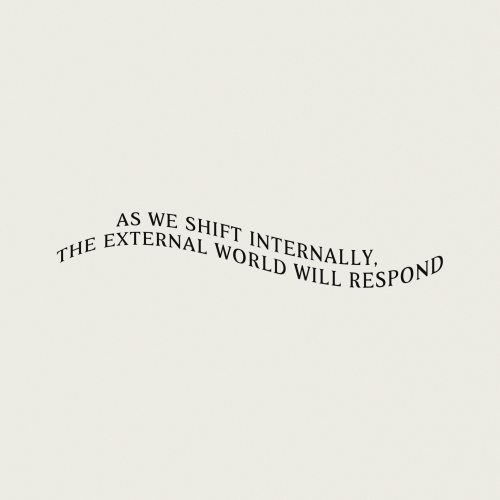

# arbr-shufl
NFT recommender mixhop similiarity shuffle against major arcana tarot pulls, expanded from [matter.direct](are.na.com/matter-direct) curated channels

magicians curation practice embedded into reed oracular tarot pulls

on chosen tarot pull direction from tri-fold decision matrix, assembled tarot NFT recommendations to be attached to tree totems out in nature using arbr (geocached logins) during walks to help further realize the future the querent seeks based upon the decision of the uniswap trade (or liquidity provision) for life inspiration & wallet identity.

turning archetypal trends into storytelling resolution for possible verkle tracing



# example

Terminal
```
Choose your major arcana tarot card
Let the portals take you..

 0. The Fool 
 1. The Magician <
 2. The High Priestess
 3. The Empress
 4. The Emperor
 5. The Heirophant
 6. The Lovers
 ...

```

### Sampling
Lets try an example. If I pulled a hanged man tarot, here is a randomly selected NFT from NFT Ports AI. I think it’s working.


# non-NPC story
Opening new browsing web4 portals IRL.

1. As a user, I set 3 intentions for various paths to choose, then cleanse & shuffle my IRL tarot deck
2. As a user, I pull 3 cards and patch the directions with the various paths.
3. As a user, I make a decision on a path, and make a uniswap swap to allocate resources to a direction.
4. As a user, I go outside to a nearby arbr tree & login.
5. As a user, I see a drop down of recommended NFTs to purchase with the taste of the tarot card direction I chose.

# diagram
replace lottery with tarot

